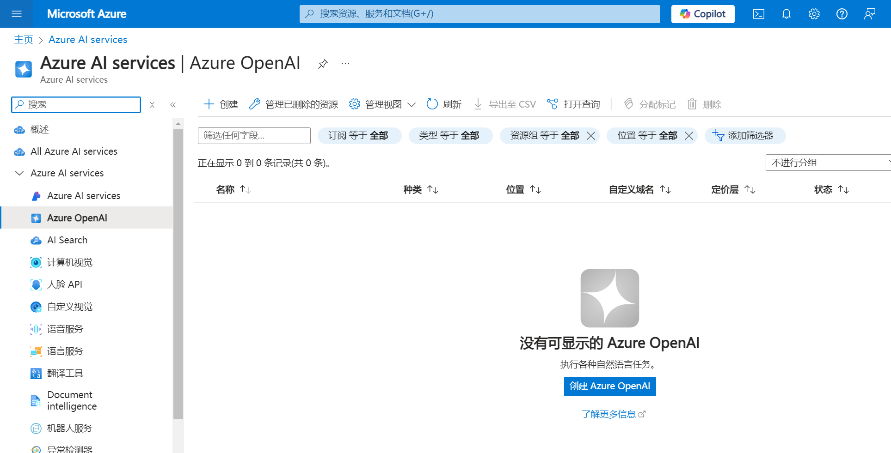
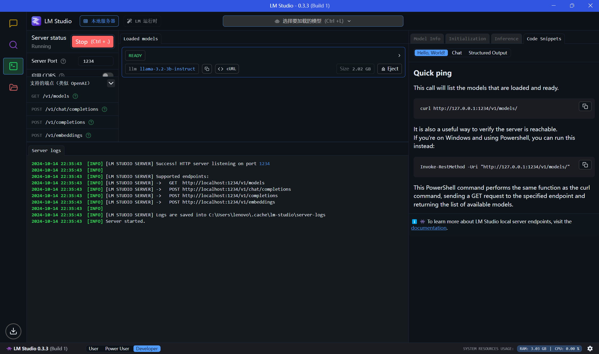
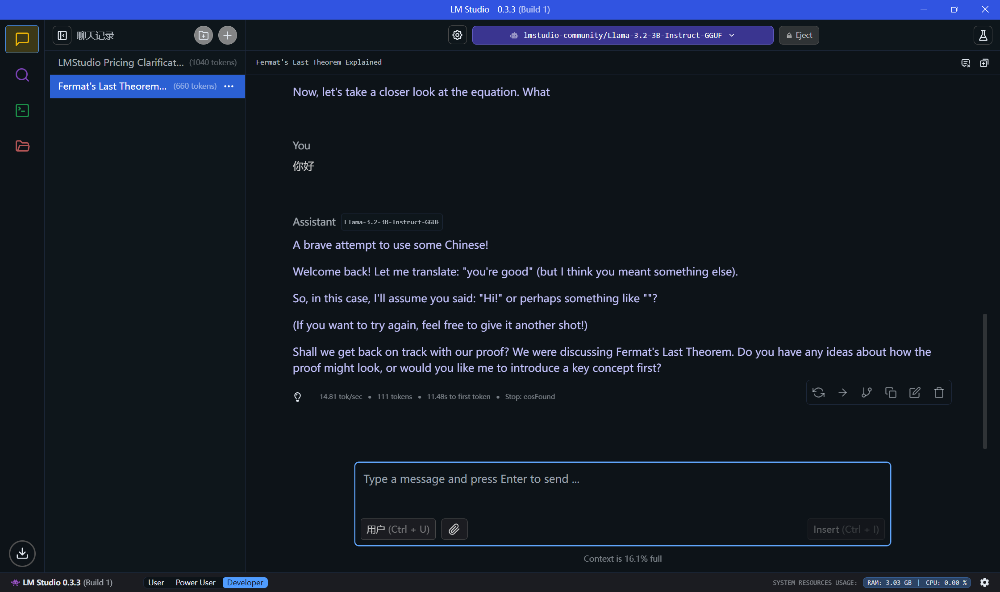
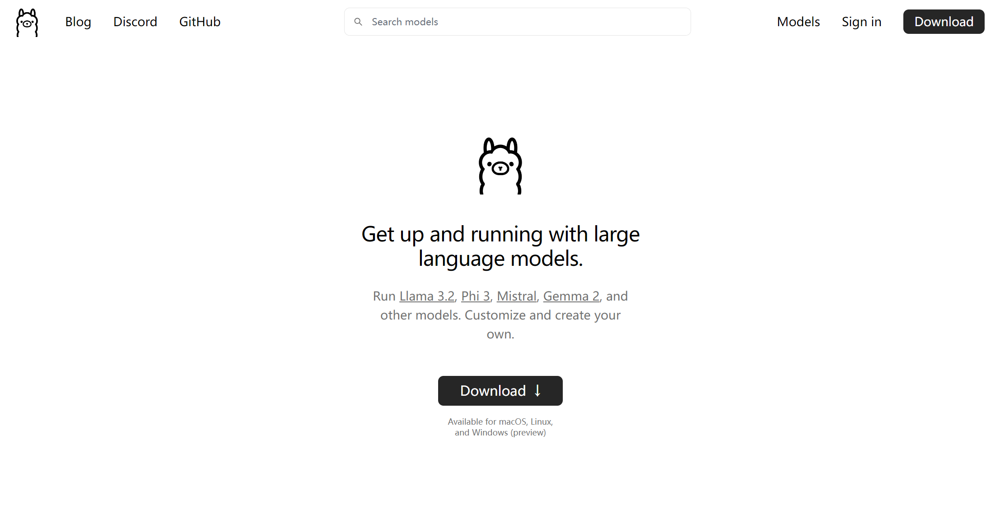

# 一点 LangChain.js

LLM 大语言模型的智能提供了 99%的帮助，而 LangChain 提供了最后的 1%
LangChain.js API 文档：[LangChain API](https://v03.api.js.langchain.com/index.html)

## 为什么是 langchain.js

LangChain.js 是一个强大的  JavaScript 库，专门用于开发与大型语言模型（如 GPT-3 或 GPT-4）交互的应用程序。它的主要目标是简化  AI  驱动的应用程序的开发过程。

LangChain 有 Python 和 JS 两个版本，而我选择 JS 版本的原因是因为我只会 JS，但是语言只是工具，重点在于其中的理念，所以使用一门熟悉的语言进行开发会更加轻松且能更快地熟悉流程。同时，作为一名前端开发的程序员，我认为使用 NodeJS 加上一些云服务的功能，迅速部署使用。同时，Python 和 JS 库的 API 都是相同的，迁移起来也很方便。

## 如何获取大模型

### 1. Azure OpenAI

能用钱解决的问题都不是问题。微软提供了完善的 OpenAI 的服务，可以在 Azure 上进行大模型的创建和部署，十分方便。

问题是，没钱。但是没有关系，因为如果没有性能要求，完全可以在自己的电脑上进行大模型下载和本地部署。

### 2. LM Studio

LM Studio 是我第一个找到的本地部署工具，可以允许用户直接从 hugging face 上下载模型并部署到本地，同时还提供了接口和聊天测试功能。很棒！！但是 LangChain 只提供了 OpenAI 和 Ollama 的 API，目前我还没有找到 LangChain.js 直接调用 LM Studio 上大模型的方法，可以通过 fetch 等方法进行调用，但是对后续的一些 API 也是不支持的。



### 3. Ollama

Ollama 同样也提供了一些模型的下载，我选择了 Meta 的 Llama 3.2，唯一的缺点就是，Llama 对中文的支持可能不如阿里的 Qwen。


## LCEL

LCEL(LangChain Expression Language)是 LangChain 提供的一个重要的概念，其目的是要帮助 AI 的整个工作流变得更加简单。同时允许进行组件化允许对一些例如 prompt 模板、解释器等进行复用，同时可以像一根链子(Chain)一样连接起来。

```JavaScript
import { Ollama } from "@langchain/community/llms/ollama"
import { HumanMessage } from "@langchain/core/messages";

const ollama = new Ollama({
  baseUrl: "http://localhost:11434",
  model: "llama3.2",
  maxRetries:0

})

await ollama.invoke([
  new HumanMessage("你好")
])
```

在一条链上，每一个模块都继承自一个 Runnable 对象，且都有相同的调用方式。

- invoke：构建用户输入
- stream：返回流式数据
- batch：进行批量输入

## LLM 的局限性

LLM 其实是一种用数据训练出来的“智能”，开发者需要向模型喂大量的数据。在使用时，其实是通过对输入内容的处理和检索，是一种概率性的智能，因此需要大量的数据集支撑。这种概率性的智能就会导致大模型出现“幻觉"，也就是模型会对自己不知道的东西胡说八道。因此就出现了 RAG 和 AI Agent 的概念。

## RAG 技术

RAG：检索加强生成技术，顾名思义，是一个检索->加强->生成的过程。

- 检索：通过用户输入搜索内容
- 加强：使内容结合 prompt 进行提问加强
- 生成：使用 prompt 进行提问，生成答案

### 数据处理

写过代码的都知道，开发时需要用到的数据，大部分不会直接写在本地，而是保存在数据库中。常见的包括关系型数据库，非关系型数据库等，能够满足日常的增删改查功能。而在 LLM 中，由于大模型需要大量的数据，这也就给数据的搜索带来了挑战。由于自然语言存在多种意思（字面意思和深层意思），导致无法直接拿用户的输入进行检索。

因此，LLM 需要一种新的数据库，向量数据库。关于向量数据库，这里先做简单的解释，就是将数据变成一个高维数值向量进行存储。同时由于 LLM 的上下文窗口有限，并不能直接将所有的数据提供给模型进行检索，所以需要对数据进行切分后再存储。[ChunkViz](https://chunkviz.up.railway.app/)

```JavaScript
  const splitter = new RecursiveCharacterTextSplitter({
    chunkSize: 100,
    chunkOverlap: 20
  })
```

### 构建向量数据库

关于向量数据库，我选择了 faiss，因为有 faiss-node 库，允许在 NodeJS 环境运行(faiss 并不是严格意义上的数据库，而是一种向量索引和相似性搜索库，主要在内存中操作)。使用 OllamaEmbeddings 创建 embeddings 模型，用于创建文字的矢量数据。

```JavaScript
const contentLoader = async () => {
  const loader = new TextLoader('PATH_TO_YOUR_FILE')
  const docs = await loader.load()

  const splitter = new RecursiveCharacterTextSplitter({
    chunkSize: 100,
    chunkOverlap: 20
  })

  const splitDocs = await splitter.splitDocuments(docs)
  const vectorStore = await FaissStore.fromDocuments(splitDocs, embeddings)
 
  const directory = 'PATH_TO_YOUR_DIRECTORY'
  await vectorStore.save(directory)
}
```

### 数据检索

在检索时将用户的输入与向量进行对比(余弦定理，最短距离算法等)，以找到最接近的一条或几条数据。下面是最简单的检索方法，k 值代表需要检索到的数据的条数，可以用于提供给大模型进行参考。

```JavaScript
const vectorstore = await FaissStore.load('directory', embeddings)
const retriever = vectorstore.asRetriever(k)
```

### 数据加强

有了数据之后，我们并不能直接对大模型进行提问，原因上面也说了，机器无法理解自然语言的意思。因此，需要一个工具帮助大模型理解他所扮演的角色以及他要做什么，以生成对我们有帮助的内容。这就是 Prompt 的工作。一个好的 Prompt 会提高检索的准确性，从而带来更符合要求的答案。

```JavaScript
const systemMessage = '你是一个专业的翻译员，你的任务是将文本从{source_lang}翻译成{target_lang}。'
const humanMessage = '请翻译这句话：{text}'

const chatPrompt = ChatPromptTemplate.fromMessages([
  ['system',systemMessage],
  ['human',humanMessage]
])

const output_parsers = new StringOutputParser()

const chatModel = new Ollama({
  baseUrl: "http://localhost:11434",
  model: "llama3.2",
  maxRetries:0
})

const chain = await chatPrompt.pipe(chatModel).pipe(output_parsers)

await chain.invoke({
  source_lang:'英文',
  target_lang:'中文',
  text:'I love programming!'
})
```

### 数据生成

至此，我们就可以来对大模型进行提问并让他提供答案了。按照检索->加强->生成的顺序，首先处理数据并存储，之后生成 prompt，最后进行大模型的调用。

```JavaScript
const model = new Ollama({
  baseUrl: 'http://localhost:11434',
  model: 'llama3.2'
})

const prompt = ChatPromptTemplate.fromTemplate(TEMPLATE)

const ragChain = RunnableSequence.from([
  {
    context: contextRetriverChain,
    question: (input) => input.question
  },
  prompt,
  model,
  new StringOutputParser()
])

await ragChain.invoke({
  question: 'questionStr'
})
```

这里我使用了 RunnableSequence 这个 API，本质上和上面的.pipe 是一样的，都是通过链式对方法进行顺序执行。

## 小结

正如蒸汽机取代了人力劳动，计算器超越了算盘的计算能力，每一次科技的飞跃都为人类带来了生产力的质的飞跃。如今，人工智能正站在革命性变革的风口浪尖。我坚信，AI 不仅仅是一种工具，更是一位强大的助手和导师，它将帮助我们跨越技术的高墙，消除专业壁垒，让每个人都有机会成为全能的数字工程师。

最后，一点小小的 AI 震撼：[Vercel v0.dev](https://v0.dev/)
